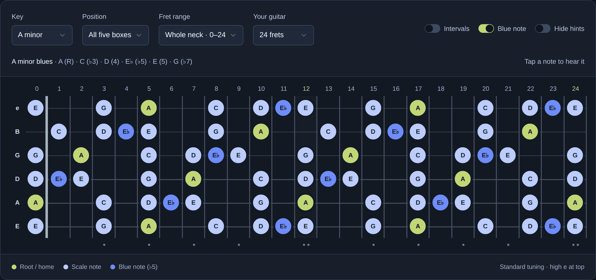
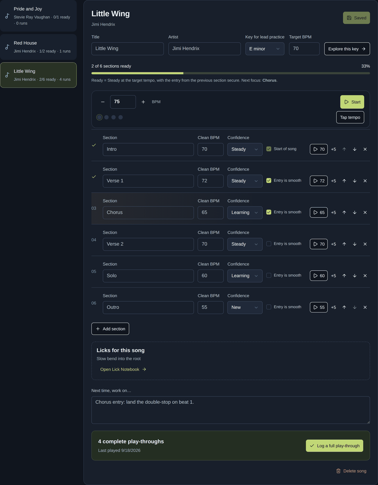
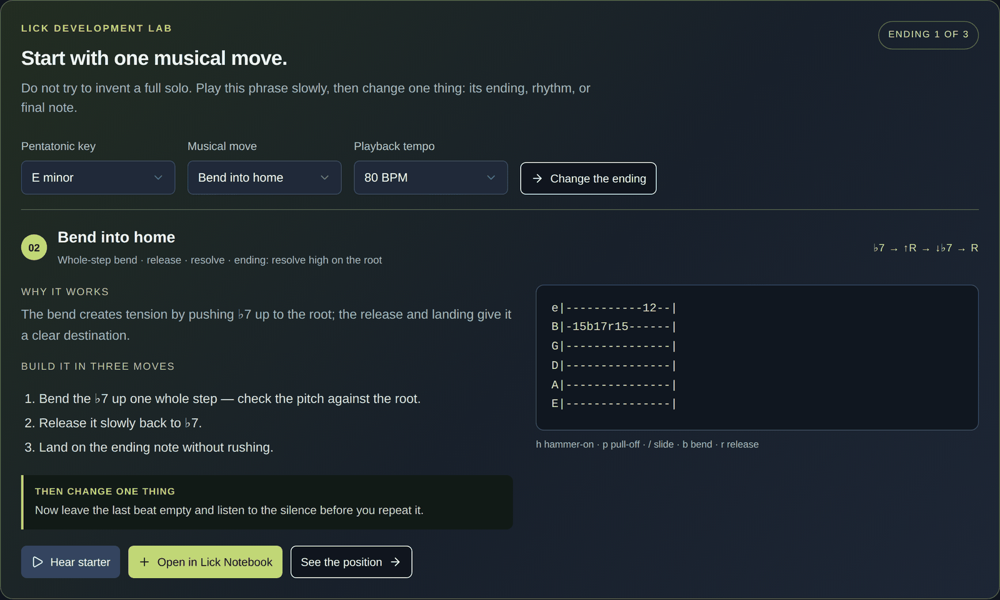
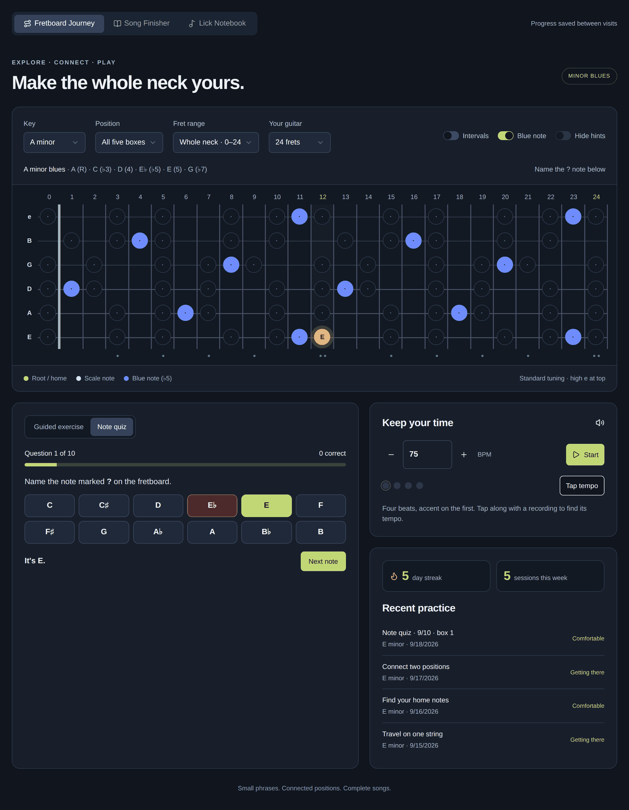
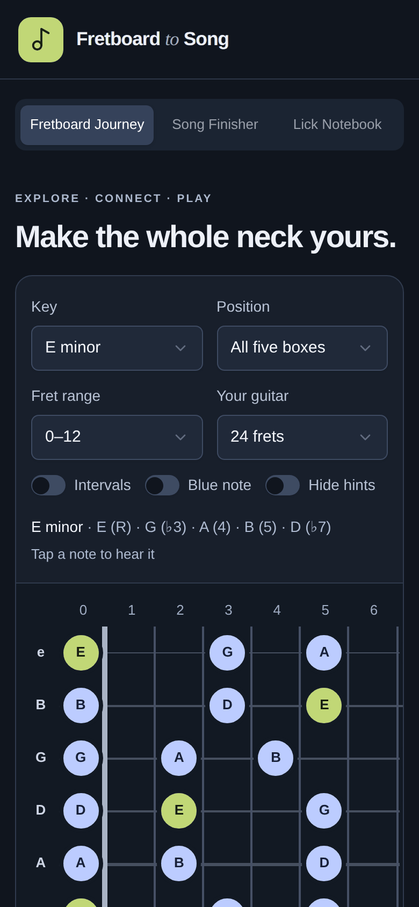

# Fretboard to Song

[](https://github.com/brucehoppe/fretboard-to-song/actions/workflows/ci.yml)
[](LICENSE)


A guitar practice app for getting out of the "box 1 rut": learn the minor pentatonic across the whole neck, turn it into licks you remember, and finish complete songs.



## Highlights

- **A tested music-theory core.** `lib/music.ts` is pure TypeScript with no framework. Its tests check every key, box shape, string and fret (0–24) against the theory, and every generated lick in every key on both 22- and 24-fret guitars.
- **One source of truth for each phrase.** Tab, interval labels and audio are all generated from a single note list, so they can't drift apart. (An earlier version labelled four of six licks incorrectly for exactly that reason.)
- **Web Audio synthesis with no samples.** Bends and slides are pitch automation on one oscillator, hammer-ons step the pitch, and the metronome uses a look-ahead scheduler so it stays in time when the main thread is busy.
- **Safe concurrent edits.** Every record carries a revision number. A save from a stale browser tab is refused with a clear message, and your unsaved text is kept.
- **Four layers of tests (344 in total).**
  - Unit tests for the theory.
  - API tests against real SQLite built from the real migrations.
  - Component tests that click every control and record which pitches actually sound.
  - Playwright tests in real browsers against the built Cloudflare Worker.
  
  The tests found real bugs, including one that crashed the local Workers runtime (see the [changelog](CHANGELOG.md)).
- **Runs at the edge.** React 19 on Cloudflare Workers via vinext, with D1 (SQLite) for storage and zod validation on every write.

| Song Finisher | Lick Development Lab |
|---|---|
|  |  |

| Practice + note quiz | Mobile |
|---|---|
|  |  |

## What it does

**Fretboard Journey** — Interactive neck (22 or 24 frets) for all 12 minor keys and the five box shapes. Toggle note names or intervals, the ♭5 blue note, and the neighbouring box. Tap any note to hear it. Six guided exercises (self-assessed) and a scored **Note quiz**: a `?` appears on the neck and you name it, ten per round, with results logged to your history. A metronome with tap tempo and a practice streak sit alongside.

**Lick Notebook** — The Lick Development Lab generates six starter phrase types (question/answer, bend, slide, legato, descending run, motif) in any key. Tab, interval labels and audio are all generated from one note list, so they always agree. Playback includes rhythm, real pitch bends and slides. "Change the ending" swaps the final note, not just the advice. Save any phrase to your notebook with key, box, technique, tab, notes, status and a linked song; search and filter by status.

**Song Finisher** — Break a song into sections, track clean tempo and confidence per section, and check off transitions. A section is *ready* when it's Steady at the target tempo and its entry is smooth. Each section can start the metronome at its tempo and nudge +5 BPM after a clean pass. Reorder, add and remove sections, see licks linked to the song, and log full play-throughs.

## Run locally

`.openai/hosting.json` holds your hosting project ID and is deliberately not committed. To deploy from a fresh clone, run `cp .openai/hosting.example.json .openai/hosting.json` and fill in `project_id`. Local development, tests and CI work without it.

Requires Node.js 22.13+ and pnpm (version pinned in `package.json`).

```sh
pnpm install --frozen-lockfile
pnpm build                                   # also generates dist/server/wrangler.json

# Apply migrations to the local D1 database, in order:
for f in drizzle/0000_good_nightmare.sql drizzle/0001_shallow_mongu.sql; do
  node --import ./scripts/sites-env.mjs ./node_modules/wrangler/bin/wrangler.js \
    d1 execute DB --local --config dist/server/wrangler.json --persist-to .wrangler/state --file "$f"
done

pnpm dev        # dev server with HMR (http://localhost:5173)
pnpm start      # or: run the built Worker locally
```

## Testing

344 automated tests across four layers (333 Vitest + 11 Playwright flows). CI runs all of them on every push (`.github/workflows/ci.yml`).

| Command | What it covers |
|---|---|
| `pnpm test:unit` | Music theory, exhaustively: every key × box × string × fret 0–24, blue-note placement, every Lick Lab move × ending × key × 22/24 frets, tab rendering, quiz pools, streaks. Also the API client. |
| `pnpm test:api` | The real `/api/practice` route against SQLite built from the real `drizzle/` migrations: every action, every validation rule, revision conflicts, deletes, origin/size checks, SQL-injection safety. |
| `pnpm test:components` | Every control in jsdom with the real components: each dropdown option, switch, button and field in all three tabs; audio verified by recording the pitches scheduled. Includes whole-app tests where `fetch` hits the real API + SQLite (load errors, retry, reload persistence, conflicts, navigation). |
| `pnpm test:e2e` | Real Chromium (desktop and a Pixel 7) against the built Worker with a fresh local D1: every key/box/range/guitar, all exercises, a full quiz round, metronome timing, every lick move, the song workflow, a two-tab conflict, and no sideways scrolling on mobile. Requires `pnpm build` first. |
| `pnpm test` | Unit + API + components |
| `pnpm test:coverage` | Same, with coverage thresholds enforced (currently ~98% statements, ~96% branches) |
| `pnpm test:all` | Typecheck, lint, coverage, build, e2e — what CI runs |

First-time e2e setup: `pnpm exec playwright install chromium`.

Test helpers live in `tests/helpers/`: a D1 fake on Node's built-in `node:sqlite`, a recording Web Audio fake, and a Radix-select driver for Testing Library.

Hosting/starter details (Sites profiles, auth headers, D1 bindings) are in [docs/STARTER.md](docs/STARTER.md).

## Code map

| Path | Purpose |
|---|---|
| `lib/music.ts` | Pure music theory: pitches, box shapes, blue note, phrase → tab/intervals, lick lab, quiz, practice stats |
| `tests/` | `unit/`, `api/`, `components/`, `e2e/` and shared `helpers/` (see Testing) |
| `app/page.tsx` | App shell: data loading, server writes, tab routing |
| `components/app/` | `journey-tab`, `fretboard`, `note-quiz`, `metronome-panel`, `licks-tab`, `lick-lab`, `songs-tab`, shared `fields` |
| `hooks/` | `use-audio` (synth, phrase playback, metronome), `use-fretboard-view` (remembered view settings), `use-stored-state`, `use-unsaved-warning`, `use-webmcp` |
| `lib/api.ts` | Client for `/api/practice` |
| `app/api/practice/route.ts` | Validated persistence with optimistic revision checks |
| `db/schema.ts`, `drizzle/` | Schema and migrations |

## Limits and next steps

This is a **single-owner** app: everyone who can reach the site shares one repertoire. Before sharing it, add per-user ownership (the starter's `getChatGPTUser()` provides a stable user id; add a `user_id` column and filter every query by it).

Ideas on the roadmap are listed in [CHANGELOG.md](CHANGELOG.md#roadmap).

## License and credits

[MIT](LICENSE) © Bruce Hoppe. Built on the vinext starter, with UI primitives from [shadcn/ui](https://ui.shadcn.com) (MIT). Security reports: see [SECURITY.md](SECURITY.md).
